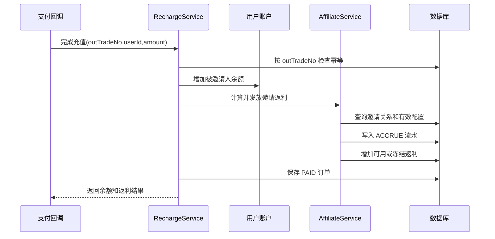

# 单级邀请返利系统详细设计

## 1. 目标与边界

本 Demo 实现 Sub2API 风格的单级邀请返利：用户分享邀请码，新用户注册时绑定唯一直接邀请人；被邀请人充值成功后，邀请人按比例获得返利；返利可冻结，到期后可转入站内余额，也可由管理员登记线下提现。

当前不实现多级分销、代理等级、团队业绩、差额返佣和自动出款。所有金额统一使用 `DECIMAL(19,8)`，Java 使用 `BigDecimal`。

## 2. 领域规则

1. 每个用户拥有唯一邀请码。
2. 一个用户最多绑定一个直接邀请人，绑定后不可修改。
3. 用户不能邀请自己。
4. 注册只建立邀请关系，不产生返利。
5. 充值完成才产生返利：`返利 = 充值金额 × 有效返利比例 / 100`。
6. 邀请人专属比例优先于全局比例。
7. 可设置返利有效天数；`0` 表示永久。
8. 可设置单个被邀请人的累计返利上限；`0` 表示不限制。
9. 可设置冻结小时数；`0` 表示直接进入可用返利。
10. 同一充值订单只允许发放一次返利。
11. 转余额一次转出全部可用返利。
12. 线下提现只负责账务登记，实际打款在站外完成。
13. 提现接口必须提供幂等键，同一个幂等键只扣减一次。

## 3. 数据模型

### `app_user` 用户账户

| 字段 | 类型 | 说明 |
|---|---|---|
| id | BIGINT | 主键 |
| email | VARCHAR(190) | 登录邮箱，唯一 |
| balance | DECIMAL(19,8) | 站内余额 |
| version | BIGINT | 乐观锁版本 |
| created_at | TIMESTAMP | 创建时间 |

### `affiliate_profile` 推广档案

| 字段 | 类型 | 说明 |
|---|---|---|
| user_id | BIGINT | 用户主键，一对一 |
| affiliate_code | VARCHAR(32) | 唯一邀请码 |
| custom_rate_percent | DECIMAL(7,4) | 专属返利比例，空则使用全局配置 |
| available_quota | DECIMAL(19,8) | 可用返利 |
| frozen_quota | DECIMAL(19,8) | 冻结返利 |
| history_quota | DECIMAL(19,8) | 历史累计返利 |
| invited_count | INT | 直接邀请人数 |
| version | BIGINT | 乐观锁版本 |

### `affiliate_relation` 邀请关系

| 字段 | 类型 | 说明 |
|---|---|---|
| invitee_user_id | BIGINT | 被邀请人，主键，保证只能绑定一次 |
| inviter_user_id | BIGINT | 直接邀请人 |
| affiliate_code_snapshot | VARCHAR(32) | 注册时邀请码快照 |
| bound_at | TIMESTAMP | 绑定时间，也是返利有效期起点 |

### `recharge_order` 充值订单

| 字段 | 类型 | 说明 |
|---|---|---|
| id | BIGINT | 主键 |
| out_trade_no | VARCHAR(64) | 外部订单号，唯一幂等键 |
| user_id | BIGINT | 充值用户 |
| amount | DECIMAL(19,8) | 实际到账金额 |
| status | VARCHAR(20) | `PAID` |
| rebate_amount | DECIMAL(19,8) | 本单实际产生返利 |
| balance_after | DECIMAL(19,8) | 本次充值完成后的用户余额快照，用于幂等重放 |
| paid_at | TIMESTAMP | 支付时间 |

### `affiliate_ledger` 返利流水

| 字段 | 类型 | 说明 |
|---|---|---|
| id | BIGINT | 主键 |
| user_id | BIGINT | 返利归属用户 |
| source_user_id | BIGINT | 产生返利的被邀请人，可空 |
| source_order_id | BIGINT | 来源充值订单，可空 |
| action | VARCHAR(20) | `ACCRUE`、`TRANSFER`、`WITHDRAW` |
| amount | DECIMAL(19,8) | 金额，始终为正数 |
| available_at | TIMESTAMP | 返利可用时间 |
| released | BOOLEAN | 冻结返利是否已释放 |
| operation_id | VARCHAR(64) | 提现幂等标识，唯一可空 |
| balance_after | DECIMAL(19,8) | 操作后用户余额快照 |
| available_after | DECIMAL(19,8) | 操作后可用返利快照 |
| frozen_after | DECIMAL(19,8) | 操作后冻结返利快照 |
| history_after | DECIMAL(19,8) | 操作后历史返利快照 |
| created_at | TIMESTAMP | 创建时间 |

### `affiliate_config` 返利配置

固定使用 `id=1`：总开关、全局比例、冻结小时、有效天数、单被邀请人封顶。

## 4. API

| 方法 | 路径 | 用途 |
|---|---|---|
| POST | `/api/v1/users/register` | 注册用户，可携带邀请码 |
| GET | `/api/v1/users/{userId}/affiliate` | 查询邀请码、邀请人数、返利余额和直接受邀人列表 |
| POST | `/api/v1/recharges/complete` | 模拟可信支付回调，完成充值和返利 |
| POST | `/api/v1/users/{userId}/affiliate/transfer` | 将全部可用返利转入站内余额 |
| PUT | `/api/v1/admin/affiliate/config` | 修改全局返利规则 |
| PUT | `/api/v1/admin/affiliate/users/{userId}/rate` | 设置或清除专属返利比例 |
| POST | `/api/v1/admin/affiliate/withdrawals` | 登记线下提现，需要 `Idempotency-Key` |

## 5. 充值返利时序

充值、用户余额、返利余额、返利流水在同一数据库事务中提交，任一步失败则整体回滚。

## 6. 冻结与解冻

Demo 使用懒解冻：查询返利详情、转余额或提现前，扫描当前用户已到 `available_at` 且 `released=false` 的 `ACCRUE` 流水，将合计金额从 `frozen_quota` 移到 `available_quota`，并将流水标记为已释放。生产系统数据量较大时可增加定时任务批量解冻，但仍应保留懒解冻作为兜底。

## 7. 并发与幂等

- 充值：`recharge_order.out_trade_no` 唯一，支付回调重试返回第一次结果。
- 提现：`affiliate_ledger.operation_id` 唯一，相同 `Idempotency-Key` 重试返回第一次结果。
- 账户和返利档案使用 `@Version` 乐观锁。
- 关键写操作通过事务完成。
- 生产高并发下可把档案读取改为 `SELECT ... FOR UPDATE`，并对唯一键冲突进行重查返回。

Demo 在充值时锁定用户账户、提现时锁定返利档案，使同一用户的并发重复请求串行化；订单保存 `balance_after`，因此顺序重放返回首次处理时的完整结果。跨用户恶意复用同一幂等键仍由唯一约束拒绝。生产实现可进一步使用独立幂等请求表，让不同用户之间也能等待首个请求完成后稳定重放。

用户返利详情中的受邀人邮箱用于演示后台数据关联。生产环境应根据权限进行脱敏并增加分页。

## 8. 从 Demo 演进到生产

1. 支付回调增加签名校验，只信任支付渠道服务器。
2. 把当前示例中的用户 ID 参数替换为登录态主体。
3. 增加订单退款和返利冲正流水，不直接删除原流水。
4. 增加管理端审计日志及操作人字段。
5. 使用 Outbox/MQ 发布“充值完成”“返利到账”事件。
6. 增加定时批量解冻和对账任务。
7. 若未来做多级分销，新建返佣规则和返佣明细，不要复用 `inviter_user_id` 硬编码层级。
