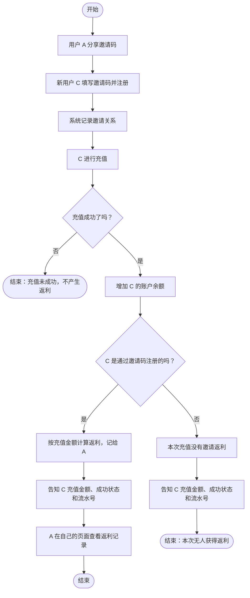
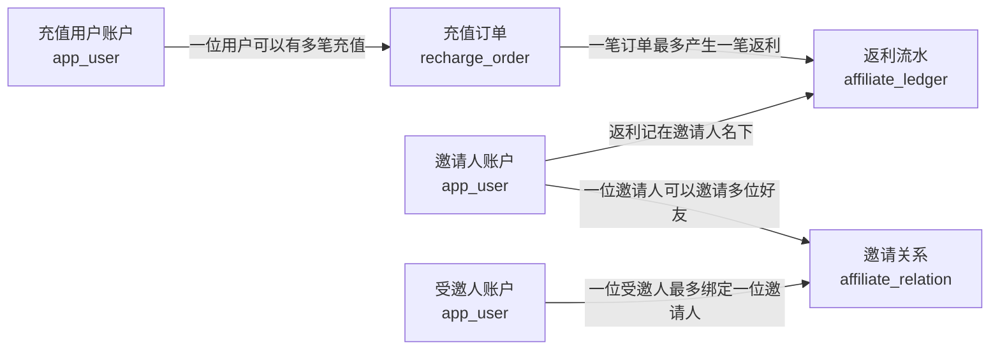

# 如何写一个简单的分销功能

很多产品都会遇到类似的需求：用户邀请朋友注册，朋友充值之后，邀请人获得一定比例的返利。

乍一看，好像注册时记一下“谁邀请了我”，充值时算一下“返多少”就行。但真正开始写代码，很快就会碰到几个问题：邀请关系放在哪里？充值订单和返利要不要放同一张表？用户本人能不能看到邀请人拿了多少返利？重复提交充值请求会不会多加一次余额？

这篇文章就拿一个简单的单级邀请返利 Demo，把这条业务链路从场景、流程、表结构一直梳理到接口，最后附上一个可以自己启动体验的 Demo。

> 【封面图片占位：邀请人、受邀人和充值返利关系示意图】

## 先把场景说清楚

假设现在有一个会员产品，用户可以给自己的账户充值。产品希望老用户帮忙邀请新用户，于是给每个用户生成一个邀请码。

用户 A 把邀请码分享给朋友 C。C 注册时填写邀请码，注册完成后，系统知道 C 是 A 邀请来的。之后 C 每次充值成功，A 都能收到充值金额 10% 的返利。

这里有两个不同的账户变化：

- C 充值 100 元，C 的站内余额增加 100 元。
- A 因为邀请了 C，获得 10 元返利。

这两笔钱属于不同的人，不能混成一笔记录。C 关心的是自己充了多少钱、充值有没有成功、充值流水号是什么；A 关心的是邀请好友带来了多少返利。因此，即使订单里需要保存本单返利的计算结果，C 的充值结果也不应该把 A 的返利展示出来。

为了把核心流程讲清楚，这个 Demo 先做最小范围：单级邀请、固定 10% 返利、模拟充值成功、返利即时入账。真实支付、退款、多级分销、提现和返利冲正都先不做。

## 先把业务流程画出来

先只看用户做什么、系统给出什么结果，不急着讲接口和数据怎么保存。用下面这张简单流程图，先把邀请返利的业务讲明白：



从业务上看，C 充值成功会增加自己的余额；只有存在邀请关系时，A 才获得返利。C 看到自己的充值结果，A 在自己的页面查看返利。流程明确后，再进入下一步，看看这些信息分别应该怎样保存。

> 【流程图占位：可将上面的业务流程图导出为图片后替换此处】

## 四张表的关系



这张图里 `app_user` 从不同业务角色连到关系和订单：同一个用户既可能是邀请人，也可能是受邀人或充值用户。关键是看清楚归属：充值订单的用户是 C，返利流水的用户是 A。

> 【截图占位：ER 图或数据库关系图】

## 表结构怎么设计

设计表时我会先问一个很实际的问题：这件事发生以后，我们希望以后还能查到什么？

这个场景至少要能查到“用户是谁”“谁邀请了谁”“谁充值了多少”“返利最终记给了谁”。这四类信息的归属和变化方式不同，所以分别放在四张表里。这样设计不是为了把表做多，而是避免把不同人的钱和不同类型的记录混在一起。

### 用户账户：这个人是谁

用户表记录登录身份，以及用户自己的站内余额和邀请码。

| 主要字段 | 记录什么 | 为什么需要 |
|---|---|---|
| `id` | 用户编号 | 其他记录通过它找到对应用户 |
| `phone` | 登录手机号 | Demo 用手机号识别和登录用户 |
| `password_hash` | 加密后的密码 | 保存登录凭证，不能保存明文密码 |
| `role` | 普通用户或管理员 | 决定用户可以使用哪些页面和功能 |
| `balance` | 用户自己的站内余额 | C 充值成功后增加的是 C 的余额 |
| `invite_code` | 用户的邀请码 | 让新用户注册时能选择邀请人 |

### 邀请关系：这个人是谁邀请来的

用户账户本身只说明“有这个人”，并不能说明“他是谁邀请的”。因此再单独记录邀请关系。

| 主要字段 | 记录什么 | 为什么需要 |
|---|---|---|
| `invitee_user_id` | 被邀请的新用户 | 找到关系中的受邀人；一个人只绑定一个邀请人 |
| `inviter_user_id` | 发出邀请的老用户 | 知道将来有返利时应该记给谁 |
| `invite_code_snapshot` | 注册时用的邀请码 | 留下这次关系是通过哪个邀请码建立的 |
| `bound_at` | 关系建立时间 | 展示邀请时间，也便于按时间查询 |

如果把“邀请人”直接写在用户表里也能做 Demo，但将邀请关系单独保存，表达会更清楚；以后需要查看绑定时间或扩展关系规则时也更方便。

### 充值订单：用户充过什么钱

充值订单属于实际充值的用户，也就是这里的 C。它回答的是“谁在什么时候充了多少钱，结果是什么”。

| 主要字段 | 记录什么 | 为什么需要 |
|---|---|---|
| `id` | 订单内部编号 | 供其他业务记录关联订单 |
| `out_trade_no` | 充值流水号 | 让用户能识别、查询这笔充值 |
| `user_id` | 充值用户 | 说明这笔充值属于 C |
| `amount` | 充值金额 | 记录用户本次充值了多少 |
| `request_key` | 本次请求的唯一标识 | 防止重复提交导致余额重复增加 |
| `balance_after` | 充值后的余额 | 保留这次充值完成时的余额结果 |
| `rebate_amount` | 本单计算出的返利快照 | 供后台核对本单计算；不返回给充值用户 |
| `paid_at` | 充值成功时间 | 展示和排序充值记录 |

订单里保存返利快照，是为了保留“这笔充值当时算出了多少返利”；真正归属到谁、产生了哪笔返利，则通过下一张表表达。C 的充值页面只展示自己的金额、成功结果和流水号，不展示返利。

### 返利记录：返利最后给了谁

返利记录属于拿到返利的邀请人，也就是这里的 A。它回答的是“哪笔充值给 A 带来了多少返利”。

| 主要字段 | 记录什么 | 为什么需要 |
|---|---|---|
| `id` | 返利记录编号 | 区分每一笔返利 |
| `user_id` | 获得返利的用户 | 说明返利要显示在 A 的账户下 |
| `source_order_id` | 产生返利的充值订单 | 能从返利追溯到触发它的充值 |
| `amount` | 返利金额 | 记录 A 具体获得多少钱 |
| `created_at` | 返利入账时间 | 展示和排序返利明细 |

这张表和充值订单分开，最重要的原因是两者归属人不同：订单是 C 的，返利是 A 的。查看 A 的返利时，系统按 A 的登录身份查返利记录；查看 C 的充值时，只查 C 的充值订单。

把四张表连起来看，业务故事就是：用户账户之间建立了一条邀请关系；受邀用户产生充值订单；符合条件的订单再给邀请人产生一笔返利记录。项目实际使用的字段类型和约束可以在 [`backend/src/main/resources/schema.sql`](../backend/src/main/resources/schema.sql) 中查看。

> 【截图占位：数据库表结构或 IDE 中的 schema.sql】

## 接口怎么划分

接口按用户实际要做的事情拆分，而不是把所有查询都塞进一个“分销接口”。

| 方法 | 接口 | 说明 |
|---|---|---|
| `POST` | `/api/v1/auth/register` | 注册，邀请码可选；有效邀请码建立邀请关系 |
| `POST` | `/api/v1/auth/login` | 手机号和密码登录 |
| `POST` | `/api/v1/auth/logout` | 退出登录 |
| `GET` | `/api/v1/auth/me` | 获取当前会话用户 |
| `GET` | `/api/v1/users/me/affiliate` | 查询自己的邀请码、余额和推广概览 |
| `GET` | `/api/v1/users/me/invitees` | 查询自己邀请的好友 |
| `GET` | `/api/v1/users/me/rebates` | 查询归自己所有的返利流水 |
| `GET` | `/api/v1/users/me/recharges` | 查询自己的充值历史，不含返利字段 |
| `POST` | `/api/v1/recharges/simulate` | 模拟充值成功，要求提供幂等键 |
| `GET` | `/api/v1/admin/users` | 管理员只读查询用户 |
| `GET` | `/api/v1/admin/referral-relations` | 管理员只读查询邀请关系 |
| `GET` | `/api/v1/admin/recharge-orders` | 管理员只读查询充值订单和返利快照 |
| `GET` | `/api/v1/admin/rebate-ledgers` | 管理员只读查询返利流水 |

用户侧接口的用户 ID 从服务端 Session 中取得，不接受浏览器传入 `userId` 来选择查询对象。这样 C 即使改请求参数，也不能查询 A 的返利流水。

> 【截图占位：接口清单、Swagger 页面或前端 Network 请求】

## 充值时服务端做了什么

充值需要同时修改余额、写订单、写返利流水，这几步必须在一个数据库事务里：

1. 从登录态确认当前充值用户，验证金额和幂等键。
2. 锁定充值用户账户，查询是否已经处理过同一个幂等键。
3. 找到邀请人后，按充值金额的 10% 计算返利，并四舍五入到分。
4. 增加充值用户余额，写充值订单。
5. 返利金额大于零时，再给邀请人写返利流水。
6. 如果任何一步失败，整个事务回滚。

例如 C 充值 100 元，C 的余额增加 100 元，订单保存充值信息，A 的返利流水增加 10 元。接口向 C 返回充值是否成功、金额、流水号和充值后余额；A 登录后通过自己的返利查询接口看到 10 元。

> 【截图占位：C 的充值成功结果，只展示充值流水号和金额】
>
> 【截图占位：A 的推广概览和返利明细】

## 自己运行 Demo

项目采用 JDK 17、Spring Boot 4.1.1、Vue 3、Vite 和 H2 内存数据库。需要先安装 JDK 17、Maven 3.6.3+ 和 Node.js 22.12+。

先在一个终端启动后端，在仓库根目录执行：

```powershell
mvn -f backend/pom.xml spring-boot:run
```

再打开另一个终端启动前端：

```powershell
Set-Location frontend
npm install
npm run dev
```

浏览器打开：<http://localhost:5173>

本项目没有线上演示站点，以上是本地体验地址。演示账号：

| 账号 | 手机号 | 密码 |
|---|---|---|
| 用户 A | `13800000001` | `DemoPass123` |
| 用户 B | `13800000002` | `DemoPass123` |
| 管理员 | `13800000003` | `AdminPass123` |

可以先登录 A 复制邀请码，再注册一个新用户 C 并填写邀请码。C 充值后重新登录 A，查看返利余额和明细。每次重启后端，H2 内存数据都会恢复初始状态。

> 【截图占位：Demo 首页或登录页】

## 最后

这个 Demo 的重点不是把分销系统做得多复杂，而是把三个问题分开处理：邀请关系单独记录，充值订单归充值用户，返利流水归邀请人。明确数据归属后，流程、表结构和接口权限就容易对齐。

项目的代码、详细设计和启动说明都在仓库中。可以先按上面的流程体验，再从 `schema.sql`、`RechargeService` 和 `AffiliateService` 开始对照阅读。
