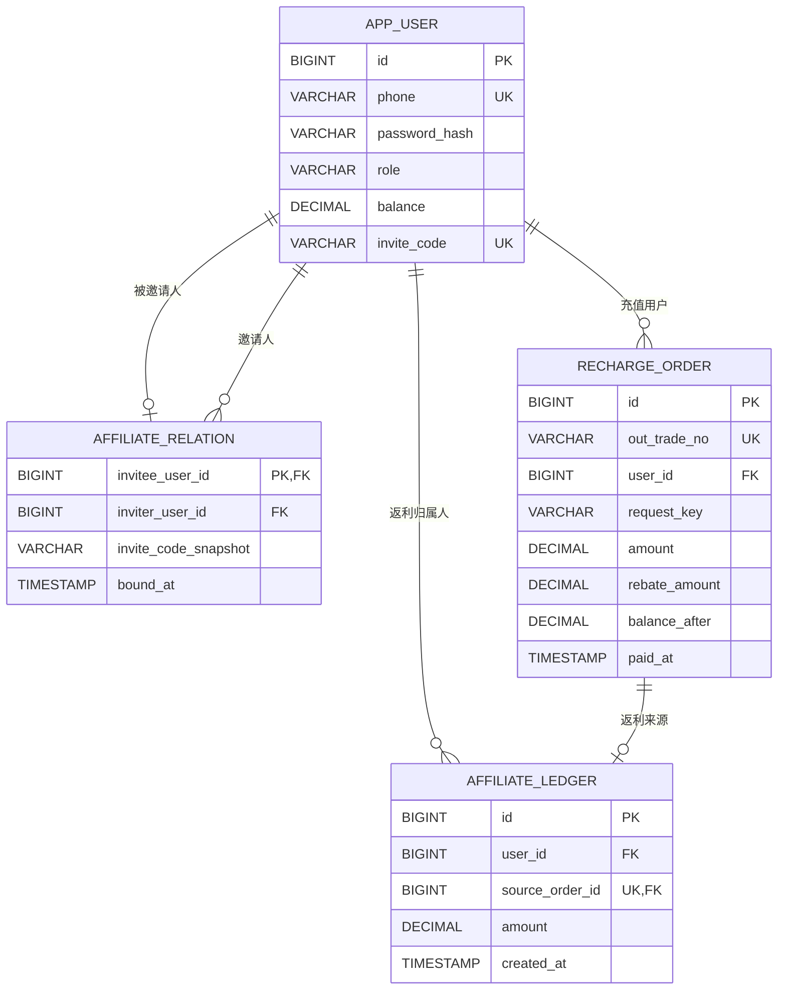
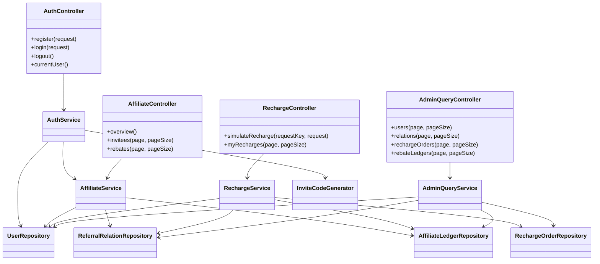
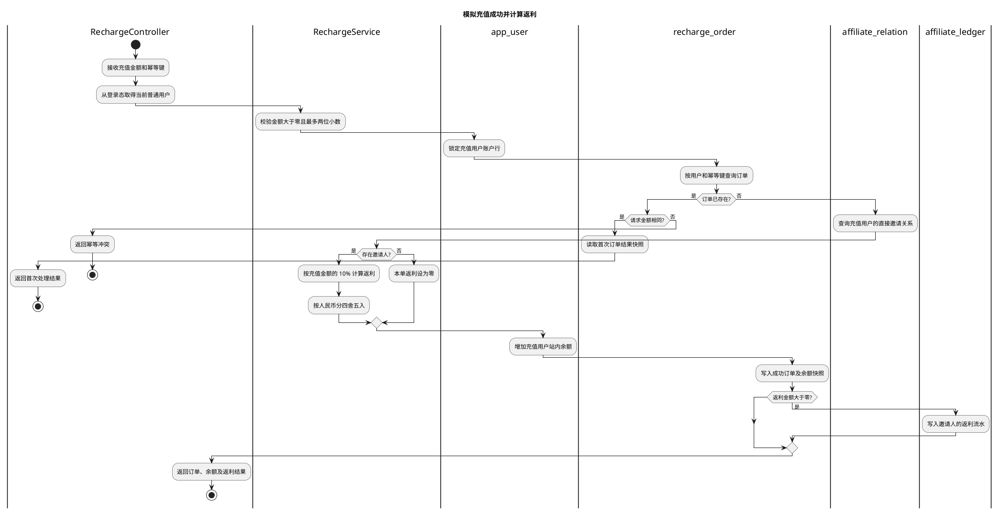

# 单级邀请返利 Demo 详细设计

**文档版本：v0.1**（2026-10-03）

**版本记录**

| 版本 | 日期 | 修改内容 |
|---|---|---|
| v0.1 | 2026-10-03 | 按已确认的 Demo 范围编写 |

---

# 1、数据架构

## 1.1 数据库 ER 模型

### 1.1.1 建模口径（全局约定）

1. 数据库使用 H2 内存模式；应用每次启动后数据重置，并初始化两个普通演示账号和一个管理员账号。两个普通账号之间不预置邀请关系、充值订单或返利。
2. 普通用户使用手机号和密码登录；密码仅保存 BCrypt 哈希。管理员由演示数据初始化，普通注册不能创建管理员。Demo 不发送短信验证码。
3. 每个普通用户注册后自动获得唯一邀请码。注册时邀请码可选；有效码绑定唯一直接邀请人，关系建立后不可变更。无效非空邀请码拒绝注册。
4. 所有金额均为人民币，数据库使用 DECIMAL(19,2)，Java 使用 BigDecimal。返利结果按 HALF_UP 四舍五入到分。
5. 充值模拟接口只记录成功充值。有效金额大于 0，充值金额增加充值用户站内余额；有邀请关系时按充值金额的固定 10% 生成即时可用返利。
6. 返利舍入结果为 0.00 时仍记录成功充值，但不生成返利流水。无邀请关系的订单返利金额为 0.00。
7. 本期不实现真实支付、退款、返利冲正、冻结解冻、返利转余额、提现及余额消费。
8. 返利余额按返利流水汇总；邀请人数按邀请关系汇总，不冗余保存累计字段。
9. 所有时间由服务端生成，数据库按 UTC 语义保存，接口使用 ISO-8601 字符串。
10. 数据库主键为 BIGINT 自增，API 中 ID 用字符串传递，避免 JavaScript 数字精度丢失。用户端数据归属从服务端 Session 获取，不信任客户端传入的 userId。

### 1.1.2 表清单

| 表名 | 名称 | 职责 |
|---|---|---|
| app_user | 用户账户 | 手机号、密码哈希、角色、站内余额和普通用户邀请码。 |
| affiliate_relation | 邀请关系 | 保存被邀请人与唯一直接邀请人的绑定关系。 |
| recharge_order | 充值订单 | 保存模拟成功的充值、返利快照和幂等信息。 |
| affiliate_ledger | 返利流水 | 保存邀请人因某笔充值获得的返利。 |

固定 10% 返利无需单独配置表；所有普通用户都可邀请，无需单独推广档案表。

### 1.1.3 ER 模型图



### 1.1.4 实体与关系说明

- 用户可作为多条邀请关系的邀请人；作为被邀请人最多有一条关系，由 affiliate_relation.invitee_user_id 主键保证。
- 一个用户可有多笔充值订单；一笔返利流水只属于一个邀请人。
- 一笔充值订单最多生成一笔返利流水；无邀请关系或返利为 0.00 时不生成流水。
- 流水归属人为邀请人，被邀请人通过来源订单的 user_id 关联得到，不重复存储。
- 管理员与普通用户共用 app_user 表。管理员邀请码为空，不得参与邀请关系和充值。

## 1.2 数据库逻辑模型

### 1.2.1 表字段定义

#### app_user 用户账户

| 字段 | 类型 | 必选 | 约束 / 默认值 | 说明 |
|---|---|---|---|---|
| id | BIGINT | 是 | 自增主键 | 用户主键。 |
| phone | VARCHAR(20) | 是 | 唯一 | 登录手机号；本 Demo 校验为 11 位手机号。 |
| password_hash | VARCHAR(100) | 是 | — | BCrypt 哈希，不返回给客户端。 |
| role | VARCHAR(16) | 是 | USER | USER 或 ADMIN；公开注册只能为 USER。 |
| balance | DECIMAL(19,2) | 是 | 0.00，非负 | 站内余额；充值成功增加，本期不消费。 |
| invite_code | VARCHAR(32) | 否 | 唯一 | USER 必填，ADMIN 为空。 |
| created_at | TIMESTAMP | 是 | 服务端生成 | 创建时间。 |
| updated_at | TIMESTAMP | 是 | 服务端生成 | 更新时间，余额变化时更新。 |

#### affiliate_relation 邀请关系

| 字段 | 类型 | 必选 | 约束 / 默认值 | 说明 |
|---|---|---|---|---|
| invitee_user_id | BIGINT | 是 | 主键、外键 | 被邀请人；保证最多绑定一次。 |
| inviter_user_id | BIGINT | 是 | 外键、普通索引 | 直接邀请人。 |
| invite_code_snapshot | VARCHAR(32) | 是 | — | 注册时使用的邀请码快照。 |
| bound_at | TIMESTAMP | 是 | 服务端生成 | 关系绑定时间。 |

inviter_user_id 不得等于 invitee_user_id；应用层校验邀请人存在且为 USER。绑定后无修改、删除接口。

#### recharge_order 充值订单

| 字段 | 类型 | 必选 | 约束 / 默认值 | 说明 |
|---|---|---|---|---|
| id | BIGINT | 是 | 自增主键 | 订单主键。 |
| out_trade_no | VARCHAR(64) | 是 | 唯一，服务端生成 | 模拟充值订单号。 |
| user_id | BIGINT | 是 | 外键、普通索引 | 充值普通用户。 |
| request_key | VARCHAR(64) | 是 | 与 user_id 组成唯一键 | 幂等键；请求重试复用。 |
| amount | DECIMAL(19,2) | 是 | 大于 0 | 成功充值金额。 |
| rebate_amount | DECIMAL(19,2) | 是 | 默认 0.00，非负 | 本单产生的返利快照。 |
| balance_after | DECIMAL(19,2) | 是 | — | 本次充值后的余额快照，用于幂等重放。 |
| paid_at | TIMESTAMP | 是 | 服务端生成 | 模拟充值成功时间。 |
| created_at | TIMESTAMP | 是 | 服务端生成 | 订单创建时间。 |

只存储成功订单，不保存待支付、失败、退款状态。同一用户重复幂等键但金额不同返回冲突。

#### affiliate_ledger 返利流水

| 字段 | 类型 | 必选 | 约束 / 默认值 | 说明 |
|---|---|---|---|---|
| id | BIGINT | 是 | 自增主键 | 流水主键。 |
| user_id | BIGINT | 是 | 外键、普通索引 | 返利归属邀请人。 |
| source_order_id | BIGINT | 是 | 唯一外键 | 来源充值订单，保证一单最多返利一次。 |
| amount | DECIMAL(19,2) | 是 | 大于 0 | 已可用返利金额。 |
| created_at | TIMESTAMP | 是 | 服务端生成 | 入账时间。 |

本期只有正向即时返利，无 action、冻结状态、提现幂等键或返利余额快照。

### 1.2.2 枚举值定义

| 字段 | 所属表 | 值 | 说明 |
|---|---|---|---|
| role | app_user | USER | 普通用户，可邀请、充值和查看本人返利。 |
| role | app_user | ADMIN | 管理员，只读查看后台数据。 |

充值订单只保存成功记录，返利流水只保存已发放记录，因此本期不设置订单状态或返利状态枚举。

## 1.3 数据库物理模型

### 1.3.1 建表语句

以下 DDL 面向 H2：

```sql
CREATE TABLE app_user (
    id BIGINT GENERATED BY DEFAULT AS IDENTITY PRIMARY KEY,
    phone VARCHAR(20) NOT NULL,
    password_hash VARCHAR(100) NOT NULL,
    role VARCHAR(16) NOT NULL DEFAULT 'USER',
    balance DECIMAL(19, 2) NOT NULL DEFAULT 0.00,
    invite_code VARCHAR(32),
    created_at TIMESTAMP NOT NULL,
    updated_at TIMESTAMP NOT NULL,
    CONSTRAINT uk_app_user_phone UNIQUE (phone),
    CONSTRAINT uk_app_user_invite_code UNIQUE (invite_code),
    CONSTRAINT ck_app_user_role CHECK (role IN ('USER', 'ADMIN')),
    CONSTRAINT ck_app_user_balance CHECK (balance >= 0),
    CONSTRAINT ck_app_user_code_by_role CHECK (
        (role = 'USER' AND invite_code IS NOT NULL) OR
        (role = 'ADMIN' AND invite_code IS NULL)
    )
);

CREATE TABLE affiliate_relation (
    invitee_user_id BIGINT NOT NULL PRIMARY KEY,
    inviter_user_id BIGINT NOT NULL,
    invite_code_snapshot VARCHAR(32) NOT NULL,
    bound_at TIMESTAMP NOT NULL,
    CONSTRAINT fk_relation_invitee FOREIGN KEY (invitee_user_id) REFERENCES app_user (id),
    CONSTRAINT fk_relation_inviter FOREIGN KEY (inviter_user_id) REFERENCES app_user (id),
    CONSTRAINT ck_relation_not_self CHECK (invitee_user_id <> inviter_user_id)
);

CREATE TABLE recharge_order (
    id BIGINT GENERATED BY DEFAULT AS IDENTITY PRIMARY KEY,
    out_trade_no VARCHAR(64) NOT NULL,
    user_id BIGINT NOT NULL,
    request_key VARCHAR(64) NOT NULL,
    amount DECIMAL(19, 2) NOT NULL,
    rebate_amount DECIMAL(19, 2) NOT NULL DEFAULT 0.00,
    balance_after DECIMAL(19, 2) NOT NULL,
    paid_at TIMESTAMP NOT NULL,
    created_at TIMESTAMP NOT NULL,
    CONSTRAINT uk_recharge_trade_no UNIQUE (out_trade_no),
    CONSTRAINT uk_recharge_request UNIQUE (user_id, request_key),
    CONSTRAINT fk_recharge_user FOREIGN KEY (user_id) REFERENCES app_user (id),
    CONSTRAINT ck_recharge_amount CHECK (amount > 0),
    CONSTRAINT ck_recharge_rebate CHECK (rebate_amount >= 0),
    CONSTRAINT ck_recharge_balance CHECK (balance_after >= 0)
);

CREATE TABLE affiliate_ledger (
    id BIGINT GENERATED BY DEFAULT AS IDENTITY PRIMARY KEY,
    user_id BIGINT NOT NULL,
    source_order_id BIGINT NOT NULL,
    amount DECIMAL(19, 2) NOT NULL,
    created_at TIMESTAMP NOT NULL,
    CONSTRAINT uk_ledger_source_order UNIQUE (source_order_id),
    CONSTRAINT fk_ledger_user FOREIGN KEY (user_id) REFERENCES app_user (id),
    CONSTRAINT fk_ledger_order FOREIGN KEY (source_order_id) REFERENCES recharge_order (id),
    CONSTRAINT ck_ledger_amount CHECK (amount > 0)
);

CREATE INDEX idx_relation_inviter_bound
    ON affiliate_relation (inviter_user_id, bound_at);
CREATE INDEX idx_recharge_user_created
    ON recharge_order (user_id, created_at);
CREATE INDEX idx_ledger_user_created
    ON affiliate_ledger (user_id, created_at);
```

### 1.3.2 索引设计

| 索引 | 类型 | 用途 |
|---|---|---|
| uk_app_user_phone | 唯一 | 注册及登录手机号查找。 |
| uk_app_user_invite_code | 唯一 | 邀请码查找及并发冲突保护。 |
| idx_relation_inviter_bound | 普通 | 按邀请人分页查询直接受邀人。 |
| uk_recharge_trade_no | 唯一 | 防止充值订单号重复。 |
| uk_recharge_request | 唯一 | 同一用户同一请求键只产生一笔订单。 |
| idx_recharge_user_created | 普通 | 查询用户充值记录。 |
| uk_ledger_source_order | 唯一 | 防止同一充值订单重复发放返利。 |
| idx_ledger_user_created | 普通 | 查询用户返利明细及余额汇总。 |

### 1.4 字段确认结论

- 手机号唯一；密码哈希不返回。公开注册固定创建 USER。
- 普通用户拥有邀请码；管理员没有邀请码。
- 余额存于 app_user；返利余额和邀请人数从明细汇总。
- 关系表以被邀请人为主键，绑定后不可更改。
- H2 每次启动恢复两个无关联普通账号及一个管理员。
- 本期无返利配置表、推广档案表、冻结、提现或退款数据。

---

# 2、接口

## 2.1 通用约定

### 2.1.1 统一响应与错误码

成功响应：

```json
{ "code": "OK", "message": "success", "data": {} }
```

失败响应：

```json
{ "code": "INVITE_CODE_INVALID", "message": "邀请码无效", "data": null }
```

| HTTP 状态码 | 用途 |
|---|---|
| 200 | 查询、登录、登出或操作成功。 |
| 201 | 用户创建成功。 |
| 400 | 参数非法。 |
| 401 | 未登录或手机号/密码错误。 |
| 403 | 已登录但不是管理员。 |
| 404 | 资源不存在。 |
| 409 | 手机号、唯一键或幂等请求冲突。 |

主要业务错误码：PHONE_ALREADY_EXISTS、LOGIN_FAILED、INVITE_CODE_INVALID、AMOUNT_INVALID、IDEMPOTENCY_CONFLICT、FORBIDDEN。

### 2.1.2 分页约定

- 参数 page 从 1 开始，pageSize 默认 20、最大 100。
- 默认按发生时间倒序；查询在数据库侧分页。
- 分页结构为 { page, pageSize, total, list }。
- 用户端数据按当前 Session 用户范围过滤；管理端列表仅管理员可访问。

### 2.1.3 命名与序列化约定

- JSON 使用 lowerCamelCase；BIGINT ID 按字符串传输。
- 金额按十进制字符串返回，前端不得以浮点数计算返利。
- 时间为 ISO-8601 字符串；后端使用 UTC 语义。
- 用户端接口不接收 userId 作为数据归属参数。
- 认证使用服务端 Session Cookie，Cookie 设置 HttpOnly；退出时销毁 Session。
- 成功注册后建立登录态并返回当前用户信息。

### 2.1.4 对象命名口径

- 请求对象以 Request 结尾，返回对象以 VO 结尾。
- 返利金额、返利比例、用户余额不可由客户端提交。
- 模拟充值必须带 Idempotency-Key。重试复用相同键；主动新充值生成新键。
- 管理端手机号列表默认脱敏。

## 2.2 邀请返利接口

### 2.2.1 注册用户

POST /api/v1/auth/register

请求体：

```json
{
  "phone": "13800000001",
  "password": "DemoPass123",
  "inviteCode": "A8K4M2QZ"
}
```

| 字段 | 类型 | 必选 | 说明 |
|---|---|---:|---|
| phone | string | 是 | 11 位手机号，唯一。 |
| password | string | 是 | 8–64 个字符，服务端 BCrypt 哈希。 |
| inviteCode | string | 否 | 邀请码；空表示无邀请关系，非空无效则拒绝注册。 |

成功返回 201，设置 Session Cookie，数据为 CurrentUserVO。用户与邀请关系在同一事务创建；请求不能指定角色、余额或自定义邀请码。

### 2.2.2 登录

POST /api/v1/auth/login

请求体为手机号和密码。成功建立 Session 并返回 CurrentUserVO。认证失败统一返回 401 LOGIN_FAILED，不区分手机号不存在或密码错误。普通演示账号和管理员账号均使用手机号、密码登录。

### 2.2.3 登出

POST /api/v1/auth/logout

销毁当前 Session；重复登出按成功处理。

### 2.2.4 查询当前会话

GET /api/v1/auth/me

返回当前账号基础信息 CurrentUserVO，前端据 role 显示用户端或管理端导航。

### 2.2.5 查询推广概览

GET /api/v1/users/me/affiliate

仅 USER 可访问。返回邀请码、站内余额、邀请人数及返利余额。邀请人数和返利余额由关系表、返利流水统计。

### 2.2.6 查询受邀人

GET /api/v1/users/me/invitees?page=1&pageSize=20

仅返回当前用户的直接受邀用户，按绑定时间倒序分页，手机号脱敏。列表项为 InviteeListItemVO。

### 2.2.7 查询返利明细

GET /api/v1/users/me/rebates?page=1&pageSize=20

仅返回当前用户的返利流水，按入账时间倒序分页，展示脱敏被邀请人手机号、来源充值订单号、金额及时间。列表项为 RebateRecordVO。

### 2.2.8 模拟充值成功

POST /api/v1/recharges/simulate

仅 USER 可访问；表示支付已模拟成功，不连接真实支付渠道。

Header：Idempotency-Key，必填，长度 1–64。

请求体：

```json
{ "amount": "100.00" }
```

返回充值订单号、充值金额、本单返利金额、充值后余额快照和成功时间。

- 金额必须大于 0 且最多两位小数。
- 返利由服务端按充值金额 × 10% 计算并四舍五入到分。
- 无邀请关系时返利为 0.00；舍入为 0.00 时不生成返利流水。
- 同一用户相同幂等键、相同金额返回首次处理结果；金额不同返回 409 IDEMPOTENCY_CONFLICT。
- 客户端不能指定充值用户、邀请人、返利金额或比例。

### 2.2.9 查询本人充值记录

GET /api/v1/users/me/recharges?page=1&pageSize=20

仅返回当前用户成功充值订单，按成功时间倒序分页。列表项为 RechargeOrderVO。

### 2.2.10 管理端查询用户

GET /api/v1/admin/users?page=1&pageSize=20

仅 ADMIN 可访问。只读返回普通用户、脱敏手机号、余额、邀请码及注册时间。

### 2.2.11 管理端查询邀请关系

GET /api/v1/admin/referral-relations?page=1&pageSize=20

仅 ADMIN 可访问。只读返回邀请人与被邀请人、邀请码快照及绑定时间；手机号脱敏。

### 2.2.12 管理端查询充值订单

GET /api/v1/admin/recharge-orders?page=1&pageSize=20

仅 ADMIN 可访问。只读返回成功订单、充值用户、充值金额、返利金额和成功时间。

### 2.2.13 管理端查询返利流水

GET /api/v1/admin/rebate-ledgers?page=1&pageSize=20

仅 ADMIN 可访问。只读返回返利归属人、被邀请人、来源订单号、金额及入账时间。

## 2.3 数据模型

### 2.3.1 公共模型

#### PageVO<T>

<a id="schemapagevo"></a>

```json
{ "page": 1, "pageSize": 20, "total": 1, "list": [] }
```

分页查询返回的统一模型。

| 名称 | 类型 | 必选 | 说明 |
|---|---|---:|---|
| page | integer | 是 | 当前页，从 1 开始。 |
| pageSize | integer | 是 | 每页条数，最大 100。 |
| total | integer | 是 | 符合条件的总数。 |
| list | array | 是 | 当前页数据。 |

#### ApiResponse<T>

<a id="schemaapiresponse"></a>

```json
{ "code": "OK", "message": "success", "data": {} }
```

统一 API 响应，字段为 code、message、data；失败时 data 为 null。

### 2.3.2 业务模型

#### CurrentUserVO

<a id="schemacurrentuservo"></a>

```json
{ "id": "1001", "phone": "138****0001", "role": "USER", "inviteCode": "A8K4M2QZ" }
```

登录、注册及当前会话信息。

| 名称 | 类型 | 必选 | 说明 |
|---|---|---:|---|
| id | string | 是 | BIGINT 字符串。 |
| phone | string | 是 | 脱敏手机号。 |
| role | string | 是 | USER 或 ADMIN。 |
| inviteCode | string | 否 | 普通用户邀请码，管理员为空。 |

#### AffiliateOverviewVO

<a id="schemaaffiliateoverviewvo"></a>

```json
{
  "userId": "1001",
  "phone": "138****0001",
  "inviteCode": "A8K4M2QZ",
  "balance": "200.00",
  "invitedCount": 1,
  "rebateBalance": "10.00"
}
```

| 名称 | 类型 | 必选 | 说明 |
|---|---|---:|---|
| userId | string | 是 | 当前用户 ID。 |
| phone | string | 是 | 脱敏手机号。 |
| inviteCode | string | 是 | 当前用户唯一邀请码。 |
| balance | string | 是 | 站内余额，十进制字符串。 |
| invitedCount | integer | 是 | 直接邀请人数。 |
| rebateBalance | string | 是 | 返利流水金额合计。 |

#### InviteeListItemVO

<a id="schemainviteelistitemvo"></a>

```json
{ "userId": "1002", "phone": "139****0002", "boundAt": "2026-10-03T08:00:00Z" }
```

| 名称 | 类型 | 必选 | 说明 |
|---|---|---:|---|
| userId | string | 是 | 被邀请人 ID。 |
| phone | string | 是 | 脱敏手机号。 |
| boundAt | string | 是 | 关系建立时间。 |

#### RebateRecordVO

<a id="schemarebaterecordvo"></a>

```json
{ "id": "8001", "inviteePhone": "139****0002", "sourceOrderNo": "R202610030001", "amount": "10.00", "createdAt": "2026-10-03T08:30:00Z" }
```

| 名称 | 类型 | 必选 | 说明 |
|---|---|---:|---|
| id | string | 是 | 返利流水 ID。 |
| inviteePhone | string | 是 | 脱敏被邀请人手机号。 |
| sourceOrderNo | string | 是 | 来源充值订单号。 |
| amount | string | 是 | 已可用返利金额。 |
| createdAt | string | 是 | 入账时间。 |

#### RechargeOrderVO

<a id="schemarechargeordervo"></a>

```json
{ "id": "5001", "outTradeNo": "R202610030001", "amount": "100.00", "rebateAmount": "10.00", "balanceAfter": "200.00", "paidAt": "2026-10-03T08:30:00Z" }
```

| 名称 | 类型 | 必选 | 说明 |
|---|---|---:|---|
| id | string | 是 | 充值订单 ID。 |
| outTradeNo | string | 是 | 服务端生成的订单号。 |
| amount | string | 是 | 充值金额。 |
| rebateAmount | string | 是 | 本单返利，无返利时为 0.00。 |
| balanceAfter | string | 是 | 充值完成后的余额快照。 |
| paidAt | string | 是 | 模拟成功时间。 |

#### AdminUserListItemVO

<a id="schemaadminuserlistitemvo"></a>

```json
{ "id": "1001", "phone": "138****0001", "role": "USER", "balance": "200.00", "inviteCode": "A8K4M2QZ", "createdAt": "2026-10-03T08:00:00Z" }
```

管理员用户列表项，手机号默认脱敏；密码哈希不返回。

#### AdminRelationListItemVO

<a id="schemaadminrelationlistitemvo"></a>

```json
{ "inviterPhone": "138****0001", "inviteePhone": "139****0002", "inviteCode": "A8K4M2QZ", "boundAt": "2026-10-03T08:00:00Z" }
```

管理员邀请关系列表项，双方手机号脱敏。

#### AdminRechargeListItemVO

<a id="schemaadminrechargelistitemvo"></a>

```json
{ "outTradeNo": "R202610030001", "phone": "139****0002", "amount": "100.00", "rebateAmount": "10.00", "paidAt": "2026-10-03T08:30:00Z" }
```

管理员充值订单列表项。

#### AdminRebateListItemVO

<a id="schemaadminrebatelistitemvo"></a>

```json
{ "ownerPhone": "138****0001", "inviteePhone": "139****0002", "sourceOrderNo": "R202610030001", "amount": "10.00", "createdAt": "2026-10-03T08:30:00Z" }
```

管理员返利流水列表项；手机号脱敏。

## 2.4 接口级待确认清单

无。接口按已确认的 Demo 规则定义；具体框架依赖版本在编码阶段按项目构建环境确定。

---

# 3、开发架构

## 3.1 实现类图

### 3.1.1 注册、充值返利和管理查询类图



### 3.1.2 类与职责

| 类 | 职责 |
|---|---|
| AuthController / AuthService | 注册、手机号密码验证、Session 创建和销毁；注册时协调用户与可选邀请关系。 |
| InviteCodeGenerator | 生成随机唯一邀请码；唯一键冲突时重试。 |
| AffiliateController / AffiliateService | 查询当前用户概览、直接受邀人和返利明细；汇总统计不落重复计数。 |
| RechargeController / RechargeService | 校验充值金额与幂等键，锁定充值账户，计算返利并原子写入订单、余额和流水。 |
| AdminQueryController / AdminQueryService | 以只读方式分页查询管理端四类数据；每个入口验证 ADMIN。 |
| Repository | 封装 app_user、affiliate_relation、recharge_order、affiliate_ledger 的数据读写。 |

### 3.1.3 类之间的关系

- Controller 调用 Service，Service 调用 Repository；Controller 不直接操作 Repository。
- 注册事务在 AuthService 内创建用户及可选邀请关系；任一写入失败整体回滚。
- RechargeService 是本模块唯一允许增加站内余额及创建返利流水的服务。
- AffiliateService 和 AdminQueryService 从明细表统计，不维护邀请人数或返利余额的冗余计数器。
- 类图表示调用依赖，不表示框架代理、依赖注入容器和数据库连接。当前无继承层次、MQ 或外部支付服务。

### 3.1.4 未画图接口的实现说明

- 登录、登出和当前会话查询按 AuthController → AuthService → UserRepository 执行。
- 推广概览从 Session 取得当前用户；受邀人、返利、充值列表均在数据库侧按当前用户过滤并分页。
- 管理端查询由 AdminQueryService 执行，只读返回脱敏手机号，不返回密码哈希。
- 参数空值语义：inviteCode 缺省或空白表示无邀请关系；非空无效码必须报错，不能静默忽略。
- 影响行数不符合预期或当前用户不存在时，业务操作失败并回滚；不得忽略余额更新失败。
- 同幂等键相同金额返回原结果；同幂等键不同金额返回冲突。

### 3.1.5 跨模块调用约定

- 本 Demo 是单体应用、单数据库事务，不通过 HTTP 调用本应用自身，不使用消息队列。
- 用户余额属于充值用户；返利流水属于邀请人，两者分开记账。
- Session 主体是当前身份的唯一可信来源；客户端不能选择其他用户 ID 操作。
- 管理员仅有后台查询权限，服务端不能提供修改关系、修改比例、改余额或改流水的接口。

## 3.2 包设计

### 3.2.1 包结构

```text
backend/src/main/java/com/example/affiliate/
├── common/api/                 # 统一响应和分页
├── common/exception/           # 业务异常与统一异常映射
├── common/security/            # Session 当前用户、角色校验、手机号脱敏
├── config/                     # H2、Session、CORS、演示数据初始化
├── auth/controller/
├── auth/dto/
├── auth/service/
├── user/entity/
├── user/repository/
├── user/service/
├── affiliate/controller/
├── affiliate/entity/           # 邀请关系、返利流水
├── affiliate/repository/
├── affiliate/service/
├── recharge/controller/
├── recharge/entity/
├── recharge/repository/
├── recharge/service/
└── admin/controller/
    ├── dto/
    └── service/

frontend/src/
├── api/                         # auth、affiliate、recharge、admin
├── router/                      # 路由与角色守卫
├── stores/                      # 当前 Session 展示状态
├── views/auth/                  # 登录、注册
├── views/user/                  # 推广概览、模拟充值、个人明细
├── views/admin/                 # 用户、关系、充值、返利只读列表
└── components/                  # 分页、金额、手机号脱敏展示
```

### 3.2.2 分层调用规则

1. Controller 只处理 HTTP 输入、响应和角色入口检查，不写业务计算。
2. Service 负责业务规则、事务及多 Repository 协作。
3. Entity 不直接作为 API 响应；接口使用明确 DTO/VO。
4. 前端只展示服务端金额，不负责计算并提交返利或余额。
5. 前端路由守卫用于导航体验；服务端必须再次校验 Session 和角色。
6. 密码用 BCrypt 哈希后入库；演示账号凭据由本地开发配置提供。
7. H2 初始化器创建两个普通用户和一个管理员；邀请码通过正式生成逻辑创建，普通用户间不预置邀请关系。

---

# 4、运行流程

充值成功和返利发放涉及账户、邀请关系、订单和流水多个数据对象，因此绘制活动图。登录、注册、列表查询和后台只读查询用文字说明。

## 4.1 邀请返利流程

### 4.1.1 模拟充值成功活动图



### 4.1.2 其余接口的实现逻辑（文字）

#### 注册和绑定邀请人

1. 规范化手机号和可选邀请码，校验手机号唯一、密码长度及邀请码格式。
2. 非空邀请码必须匹配已有 USER；否则拒绝注册。
3. BCrypt 哈希密码，生成新的唯一邀请码并创建 USER。
4. 有邀请人的情况下写入邀请关系，invitee_user_id 为新用户。
5. 用户与关系在一个事务中提交；成功后建立 Session。并发手机号冲突由唯一约束兜底并映射为 PHONE_ALREADY_EXISTS。

#### 登录与账号切换

1. 根据手机号查询用户并校验密码哈希，成功后建立服务端 Session。
2. 密码错误统一返回 LOGIN_FAILED，不透露手机号是否已注册。
3. 切换演示账号先退出当前 Session，再以另一账号登录。
4. 根据角色显示用户或后台导航，但所有请求仍由服务端校验权限。

#### 用户端查询

- 推广概览查询当前用户的邀请关系数、返利流水金额合计、邀请码和余额。
- 受邀人列表只查当前用户作为 inviter 的关系，并脱敏手机号。
- 返利列表只查当前用户作为流水归属人，关联来源订单及被邀请人。
- 本人充值列表只查当前用户成功充值订单。
- 查询均使用数据库分页并按时间倒序。

#### 管理端查询

- 用户、邀请关系、充值订单和返利流水分别分页查询。
- 只读返回；手机号脱敏；不得返回密码哈希。
- 管理端权限由服务端 ADMIN 角色校验，隐藏前端菜单不构成权限控制。

### 4.1.3 事务与并发

#### 注册事务

用户账户与可选邀请关系在同一事务创建。手机号唯一索引是并发重复注册的最终保障；邀请关系写入失败时回滚新用户。邀请码生成遇唯一冲突时重新生成，超过重试上限则回滚。

#### 充值事务

充值成功在一个数据库事务中完成：

1. 从登录态确定充值用户，以 SELECT FOR UPDATE 锁定该用户账户。
2. 按当前用户和幂等键查询已有订单；相同金额返回首次结果，不同金额返回冲突。
3. 查询当前用户邀请关系并计算返利。
4. 增加充值用户余额，创建充值订单和余额快照。
5. 返利大于 0.00 时创建唯一来源订单的返利流水。
6. 任一写入失败时整体回滚，不能出现只更新余额或只写部分流水。

#### 幂等与并发控制

- 前端每次主动充值生成新的 Idempotency-Key；同一次网络重试必须复用旧键。
- 数据库唯一约束 (user_id, request_key) 和 affiliate_ledger.source_order_id 是防止重复入账的最终保护。
- 当前用户行写锁串行化其余额更新与幂等检查。不同受邀人的充值无需争抢邀请人的汇总余额，因为返利余额实时由流水汇总。
- 并发唯一键冲突后回滚，再查询已提交订单；仅在登录用户和金额都相同的情况下重放原结果。
- 本期没有退款或返利冲正；后续增加时应新建反向流水，不删除或改写原始返利记录。

---

# 本期明确不包含

- 测试用例设计。
- 日志设计。
- 真实支付、退款及退款后的返利冲回。
- 返利冻结、解冻、转入余额、提现。
- 可配置返利比例、邀请人专属比例、返利有效期和封顶规则。
- 多级分销、代理等级、团队业绩和自动出款。
- 用户管理写操作和返利管理写操作。

